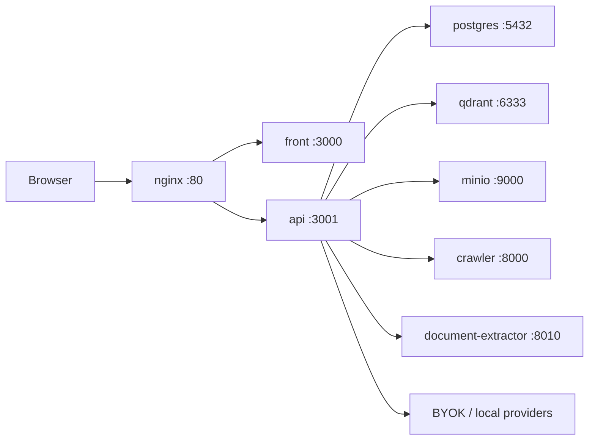

# IgnitionRAG Community

Free self-hosted distribution for IgnitionRAG.

IgnitionRAG is an administrable AI backend for multimodal RAG agents. Developers
integrate it through API, SDK, widgets, or MCP. Operators manage documents,
collections, providers, updates, backups, and diagnostics from a dashboard.

Community is the free self-hosted edition. It is full-featured and does not
require a license key. Bring your own LLM, embedding, storage, and email
providers.

## What This Repository Contains

This repository is the public distribution layer, not the product core.

It includes:

- Docker Compose deployment files.
- Nginx reverse proxy configuration.
- Local auth and bootstrap configuration.
- Backup, restore, update, doctor, and smoke-test scripts.
- Signed release manifests for digest-pinned updates.
- Supported extension folders: `plugins/`, `themes/`, and `custom-connectors/`.
- Documentation for customization, updates, and Enterprise upgrade.

The product core is shipped as versioned container images:

- `ghcr.io/ignitionai/ignition-rag-api`
- `ghcr.io/ignitionai/ignition-rag-front`
- `ghcr.io/ignitionai/ignition-rag-crawler`
- `ghcr.io/ignitionai/ignition-rag-document-extractor`

## Community Vs Enterprise

Community is free to use, including in production.

Community includes:

- Full IgnitionRAG product features.
- Self-hosted Docker Compose deployment.
- Local authentication.
- BYOK provider configuration.
- Public stable release channel.
- Local backups, restore, update dry-runs, and diagnostics.
- Supported customization through config, compose overrides, plugins, themes,
  and custom connectors.

Community does not include:

- Paid support, SLA, onboarding, or priority hotfixes.
- White-label or managed-service resale rights.
- IgnitionAI-hosted LLM, embedding, email, auth, billing, or storage keys.
- Contractual assistance for client delivery.

Use Enterprise when you need support, SLA, onboarding, cabinet or agency client
delivery rights, white-label rights, managed-service resale, signed license
material, or guided migrations. See [docs/UPGRADE-ENTERPRISE.md](docs/UPGRADE-ENTERPRISE.md).

## Architecture



Default local ports:

| Service | Port |
| --- | ---: |
| App via nginx | `80` |
| PostgreSQL | `5432` |
| Qdrant HTTP | `6333` |
| Qdrant gRPC | `6334` |
| MinIO API | `9000` |
| MinIO console | `9001` |

## Requirements

- Docker Engine with Docker Compose v2.
- Python 3.11 or newer.
- Bun 1.3 or newer for the `bun run ...` command wrappers.
- `curl` for smoke tests and Qdrant snapshot restore.
- Available local ports listed above, or a `docker-compose.override.yml` that
  remaps them.

Bun is only used as a script runner in this repository. Every script also lives
under `scripts/` and can be run directly with `python3`.

## Quickstart

1. Clone and enter the repository.

```bash
git clone https://github.com/salim4n/ignition-rag-community.git
cd ignition-rag-community
```

2. Create your environment file.

```bash
cp .env.example .env
```

3. Edit `.env`.

At minimum, change:

- `ENCRYPTION_KEY`
- `SELF_HOSTED_BOOTSTRAP_EMAIL`
- `SELF_HOSTED_BOOTSTRAP_PASSWORD`
- Provider keys such as `OPENAI_API_KEY`, or local provider settings

Generate a strong local encryption key:

```bash
openssl rand -base64 32
```

Community defaults:

```env
DEPLOYMENT_MODE=self_hosted
IGNITION_EDITION=community
AUTH_PROVIDER=local
BILLING_PROVIDER=none
EMAIL_PROVIDER=none
```

4. Check the installation.

```bash
bun run self-hosted:doctor
```

5. Pull and start the stack.

```bash
docker compose pull
docker compose up -d
```

6. Run the smoke test.

```bash
bun run self-hosted:smoke
```

7. Open the app.

```text
http://localhost/sign-in
```

Sign in with `SELF_HOSTED_BOOTSTRAP_EMAIL` and
`SELF_HOSTED_BOOTSTRAP_PASSWORD` from `.env`.

## Commands

| Command | Purpose |
| --- | --- |
| `bun run self-hosted:doctor` | Validate local prerequisites and Community configuration. |
| `bun run self-hosted:smoke` | Check health, local login, admin diagnostics, license, backups, and update-check endpoints. |
| `bun run self-hosted:backup` | Create a local backup under `${BACKUP_DIR:-./backups}`. |
| `bun run self-hosted:update --manifest releases/community-manifest.json --dry-run` | Validate the current release manifest without changing services. |
| `bun run self-hosted:update --manifest releases/community-manifest.json --apply` | Apply a signed, digest-pinned release after all guards pass. |
| `bun run self-hosted:restore --backup <backup-id> --confirm <backup-id>` | Restore a specific backup explicitly. |

## Backups

Create a backup before every update:

```bash
bun run self-hosted:backup
```

Backups are written to:

```text
${BACKUP_DIR:-./backups}/ignition-<timestamp>/
```

A backup contains:

- `manifest.json` with version, providers, compose services, and checksums.
- `postgres.dump` from the Compose `postgres` service.
- `qdrant/*.snapshot` files for Qdrant collections.
- `minio-data.tar.gz` for MinIO object data.
- `env.redacted.json` with secrets redacted.
- Previous `.self-hosted/docker-compose.release.yml` when present.

`backups/` is ignored by git.

## Updates

Community uses the public stable release channel.

The current signed stable manifest is:

```text
releases/community-manifest.json
```

Always run:

```bash
bun run self-hosted:backup
bun run self-hosted:update --manifest releases/community-manifest.json --dry-run
```

Then apply:

```bash
bun run self-hosted:update --manifest releases/community-manifest.json --apply
```

The update CLI refuses unsafe updates when:

- The manifest schema is invalid.
- The manifest edition is not `community`.
- Image digests are missing or not sha256-pinned.
- The signature is missing or a placeholder.
- A required backup is missing.
- An installed extension declares incompatible core or extension API versions.

On apply, the CLI writes:

```text
.self-hosted/docker-compose.release.yml
```

That file pins services to immutable image digests, then Compose pulls those
images, starts the release, runs database migrations, and launches the smoke
test.

There is no automatic destructive rollback in Community V1. If an apply fails,
restore explicitly:

```bash
bun run self-hosted:restore --backup <backup-id> --confirm <backup-id>
```

More details: [docs/UPDATES.md](docs/UPDATES.md).

## Customization Contract

Automatic updates assume the core container images are not modified.

Supported customization surfaces:

- `.env`
- `docker-compose.override.yml`
- `plugins/`
- `themes/`
- `custom-connectors/`
- External integrations through API, SDK, widgets, or MCP

Do not patch files inside the core images if you want smooth updates.

Extensions should include an `ignition-extension.json` manifest:

```json
{
  "id": "customer-theme",
  "name": "customer-theme",
  "type": "theme",
  "version": "1.0.0",
  "compatibility": {
    "minCore": "2026.05.0",
    "maxCore": "2026.12.0",
    "extensionApi": "1.0"
  },
  "hooks": [{ "name": "theme.tokens" }]
}
```

V1 extension hooks are explicit and declarative. Community does not execute
arbitrary plugin code. Supported hooks are `admin.diagnostics.card`,
`theme.tokens`, and `customConnector.registry`.

More details: [docs/CUSTOMIZATION.md](docs/CUSTOMIZATION.md).

## Configuration Reference

Core edition settings:

| Variable | Community value | Notes |
| --- | --- | --- |
| `DEPLOYMENT_MODE` | `self_hosted` | Enables self-hosted runtime behavior. |
| `IGNITION_EDITION` | `community` | Enables free Community entitlements. |
| `AUTH_PROVIDER` | `local` | Uses built-in local auth. |
| `BILLING_PROVIDER` | `none` | No Stripe or license billing. |
| `EMAIL_PROVIDER` | `none` | No outbound email by default. |

Important operational settings:

| Variable | Purpose |
| --- | --- |
| `ENCRYPTION_KEY` | Encrypts local sensitive material. Use at least 32 characters. |
| `SELF_HOSTED_BOOTSTRAP_EMAIL` | Initial admin login email. |
| `SELF_HOSTED_BOOTSTRAP_PASSWORD` | Initial admin login password. Change before any non-local use. |
| `OPENAI_API_KEY` / provider keys | BYOK model provider credentials. |
| `BACKUP_DIR` | Local backup directory. Defaults to `./backups`. |
| `IGNITION_RELEASE_PUBLIC_KEY` | Ed25519 public key distributed for release-manifest verification by compatible tooling. |

Storage and vector defaults:

| Variable | Default |
| --- | --- |
| `DATABASE_URL` | Compose PostgreSQL connection string. |
| `QDRANT_URL` | `http://qdrant:6333` |
| `QDRANT_PUBLIC_URL` | `http://localhost:6333` |
| `S3_ENDPOINT` | `http://minio:9000` |
| `S3_PUBLIC_ENDPOINT` | `http://localhost:9000` |
| `S3_BUCKET` | `ignition-rag-storage` |

## Production Checklist

Before exposing the instance outside your machine:

- Change `ENCRYPTION_KEY`.
- Change `SELF_HOSTED_BOOTSTRAP_EMAIL`.
- Change `SELF_HOSTED_BOOTSTRAP_PASSWORD`.
- Change PostgreSQL and MinIO credentials.
- Configure HTTPS in front of nginx or replace the local nginx setup.
- Restrict public access to PostgreSQL, Qdrant, and MinIO ports.
- Configure real provider keys or local model providers.
- Run `bun run self-hosted:backup`.
- Run `bun run self-hosted:smoke`.
- Store backups outside the host or replicate them to external storage.

## Repository Layout

```text
.
├── docker-compose.yml
├── nginx/
├── releases/
│   ├── community-manifest.json
│   └── community-manifest.example.json
├── scripts/
│   ├── backup.py
│   ├── doctor.py
│   ├── restore.py
│   ├── smoke.py
│   └── update.py
├── docs/
│   ├── CUSTOMIZATION.md
│   ├── QUICKSTART.md
│   ├── UPDATES.md
│   └── UPGRADE-ENTERPRISE.md
├── plugins/
├── themes/
└── custom-connectors/
```

The extension folders may be empty in git. They are mounted into the API
container when present.

## Troubleshooting

`docker compose pull` returns `denied`.

The GHCR package is not public or the registry requires authentication. Confirm
the package visibility, or authenticate with a GitHub token that can read the
packages:

```bash
docker login ghcr.io
```

`bun run self-hosted:doctor` fails on `ENCRYPTION_KEY`.

Set `ENCRYPTION_KEY` in `.env` to at least 32 characters.

`bun run self-hosted:smoke` cannot log in.

Check `SELF_HOSTED_BOOTSTRAP_EMAIL` and `SELF_HOSTED_BOOTSTRAP_PASSWORD` in
`.env`, then restart the API service:

```bash
docker compose up -d api
```

`--apply` is blocked because a backup is missing.

Run:

```bash
bun run self-hosted:backup
```

Then repeat the dry-run and apply steps.

Port `80` is already in use.

Create `docker-compose.override.yml` and remap nginx:

```yaml
services:
  nginx:
    ports:
      - "8080:80"
```

Then use:

```text
http://localhost:8080/sign-in
```

## License

See [LICENSE.md](LICENSE.md).

Community is free to use, including in production, but resale, white-label, and
managed-service redistribution require a separate written agreement with
IgnitionAI. This license text is an operational draft and should be reviewed by
counsel before a public launch.
